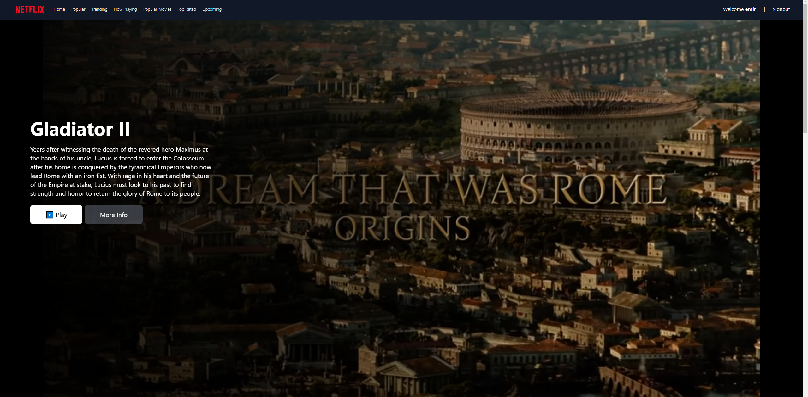
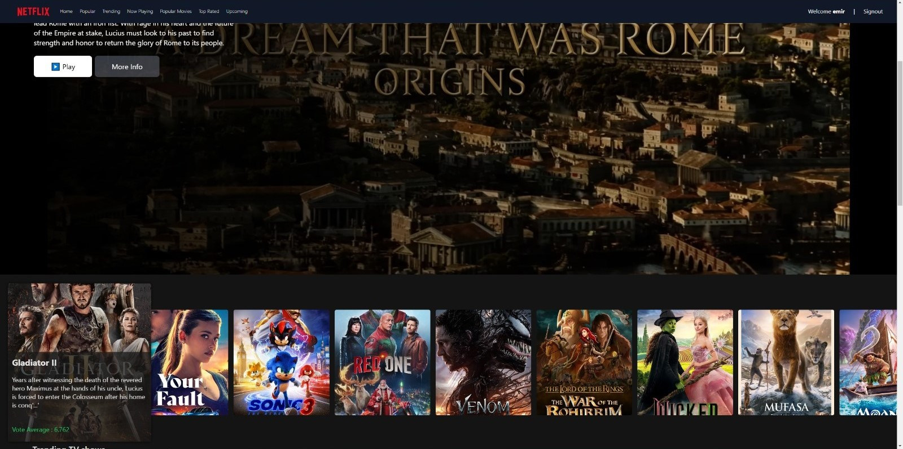
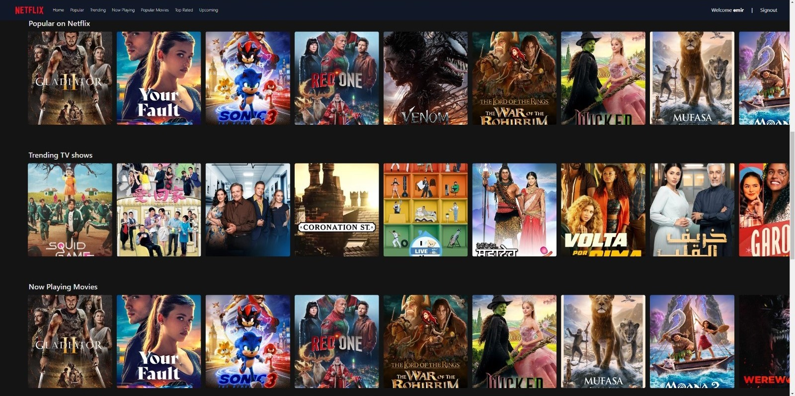

  

  <h3 align="center">Netflix Clone</h3>

  
Table of Contents

  <ol>
    <li>
      <a href="#prerequests">Prerequests</a>
    </li>
    <li>
      <a href="#screenshots">Screenshots</a>
    </li>
    <li>
      <a href="#which-features-this-project-deals-with">Which Features This Project Deals With</a>
    </li>
    <li>
      <a href="#third-party-libraries-used-except-for-angular">Third Party Libraries Used Except for Angular</a>
    </li>
    <li>
      <a href="#getting-started">Getting Started</a>
    </li>
  </ol>

 

## Screenshots

  
  
Home Page

  
  
Mini Portal

  
  
Grid Genre Page

## Prerequests

- Create an account on [TMDB](https://www.themoviedb.org/) if you don't have one.  
  This project uses TMDB's free API for movie and TV data.
- Follow the [documentation](https://developers.themoviedb.org/3/getting-started/introduction) to create an API Key.
- If you're using the v3 version of TMDB API, create a file named `.env` and copy and paste the content from `.env.example`.  
  Then, paste the API Key you created.

## Which Features This Project Deals With

- 🚀 **RxJS and Observables**: Combining multiple API calls using `forkJoin` and processing them with `map` to handle complex data flow.
- 🧩 **Service and Dependency Injection (DI)**: Managing API requests and data retrieval using `MovieService` and injecting services like `MovieService` and `ScrollService` into components for modular and testable design.
- 📦 **Component Communication**: Leveraging `@Input` to pass data from parent to child components (`MovieCarouselComponent`) and utilizing `@ViewChild` for direct interaction with DOM elements and third-party libraries (`Swiper.js`).
- 🛠️ **Usage of Directives**: Applying Angular’s built-in directives such as `*ngFor` and `*ngIf` for dynamic content rendering.
- ✨ **Pipes**: Formatting data with custom pipes like `DescriptionPipe` (trims long descriptions) and `ImagePipe` (constructs dynamic URLs for images from TMDB API).
- 🌐 **REST API Integration**: Fetching and rendering movie and TV show data from TMDB API through methods in `MovieService`.
- 🎥 **Carousel and Animations**: Creating interactive carousels for movies and TV shows using `Swiper.js` and adding visual effects with Angular animations like fade-in transitions.
- 🧩 **Reusable Components**: Designing flexible components such as `MovieCarouselComponent` for displaying various types of media content.

## Third Party Libraries Used Except for Angular

| Library          | Description                                                          |
| ---------------- | -------------------------------------------------------------------- |
| **RxJS**         | For managing data streams and event handling effectively in Angular. |
| **Swiper.js**    | For responsive carousels displaying movie visuals.                   |
| **Tailwind CSS** | For responsive and modern design.                                    |
| **Zone.js**      | For managing Angular's Change Detection mechanism.                   |
| **PostCSS**      | For transforming CSS with modern plugins.                            |
| **Autoprefixer** | For adding vendor prefixes to CSS for better browser compatibility.  |

## 🚀 Getting Started

1. Clone this repository: `git clone https://github.com/your-github-username/netflix-clone-angular.git`
2. Navigate to the project directory: `cd netflix-clone-angular`
3. Install the dependencies: `npm install`
4. Install Angular CLI globally if not installed: `npm install -g @angular/cli`
5. Create a `.env` file to configure your TMDB API Key: `cp .env.example .env`
6. Add your TMDB API Key to the `.env` file: `API_KEY=your-tmdb-api-key`
7. Start the development server: `ng serve`
8. Open your browser and go to: `http://localhost:4200`
